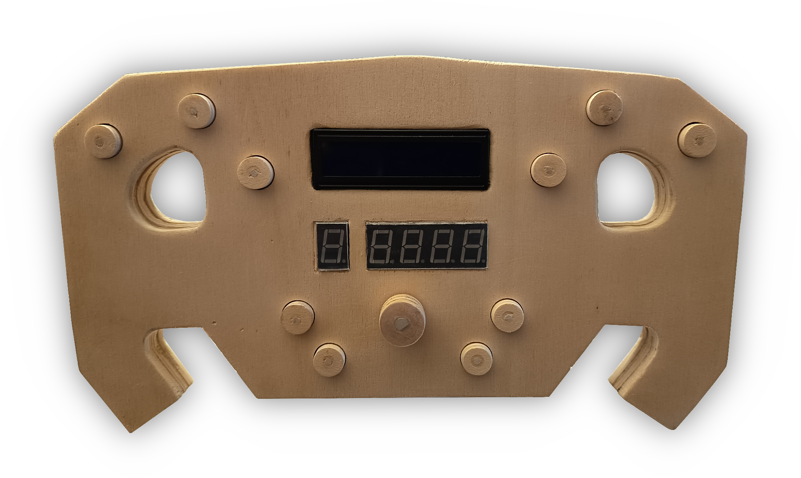
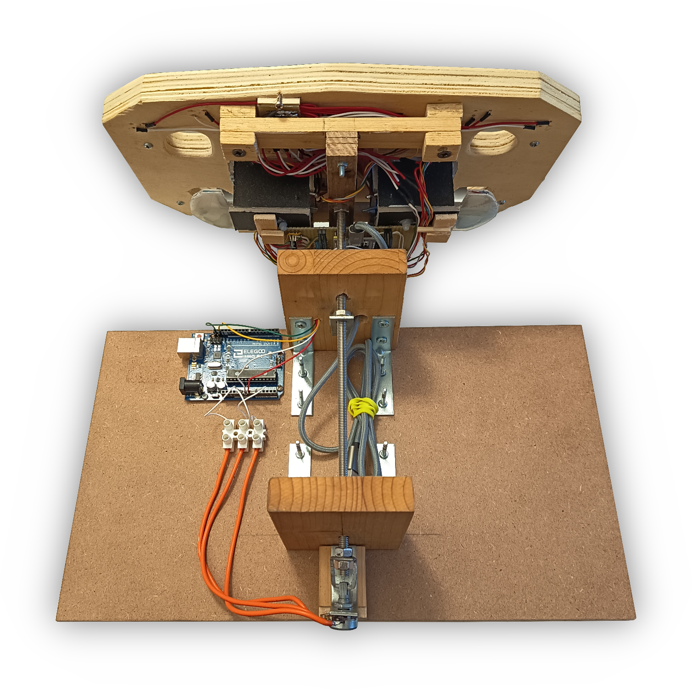
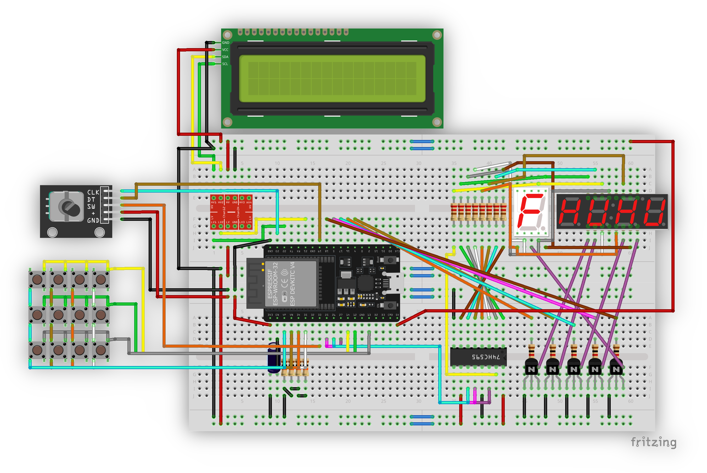

# steering-wheel
Software of a DIY simracing steering wheel.

## Pictures




## Wiring scheme

Here is a Fritzing screenshot of an initial prototype wiring scheme (no steering included). You can also download the [Fritzing circuit file](assets/scheme.fzz).



## Requirements

- Windows 10 (working) or 11 (untested)
- Esp32 UART drivers installed
- [Arduino IDE](https://www.arduino.cc/en/software/) set up for Esp32 programming
- [Python](https://www.python.org/downloads/) 3.10+ with Pip

## Setup

- Download and extract the repo zip or perform a 

    ```
    git clone https://github.com/zac06/steering-wheel
    ```

- Download and install [com0com](https://sourceforge.net/projects/com0com/)
- Run the `Setup` application provided with it
- Create a `COM20` and `COM30` pair
- Download and install [VJoy](https://github.com/BrunnerInnovation/vJoy/releases)
- In the `Configure VJoy` tool, enable controller number `1` and turn on at least 16 buttons, ensure that `Enable VJoy` is turned on
- Download and install [SimHub](https://www.simhubdash.com/) for processing the game/simulator telemetry data in a unified way
- In SimHub, enable the `Custom serial devices` plugin
- Import the `simhub/shsettings.shsds` settings file using the `Import settings` button
- From the main project directory, run
    ```
    pip install -r bridge/requirements.txt
    ```
- Open the Arduino IDE on the `esp32/steering-wheel` project
- Flash the ESP32 
- Open the Arduino IDE on the `arduino/reader` project
- Flash the Arduino (UNO/Nano) 
- You're all set! Run the `bridge/vjoy_mapper.py` script with Python and then run the serial plugin on SimHub on the `COM30` port. 

Now run your favourite game and enjoy!